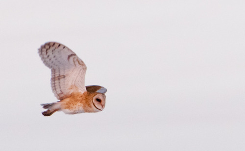
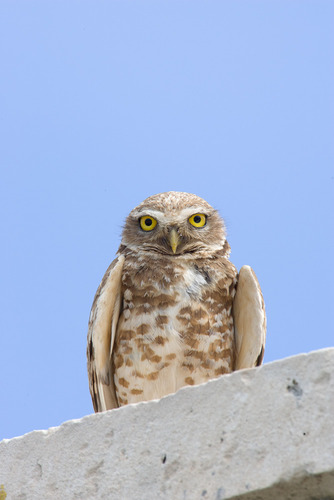
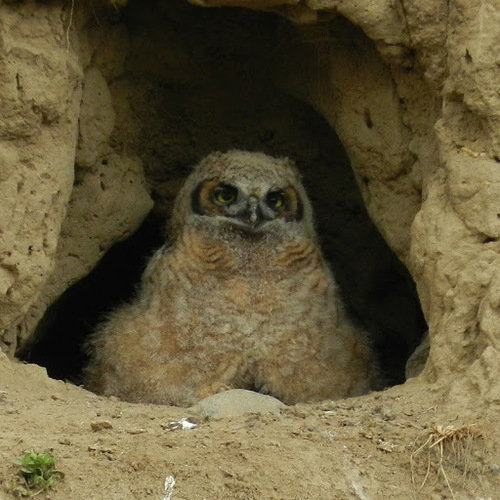

**Problem Statement:**
The objective was to perform classification on images of three owl species: Bubo virginianus (Virginia), Athene cunicularia (Rabbit), and Tyto alba (Common_Scops).

Tyto alva Owl

Athene cunicularia Owl

Bubo virginianus Owl
